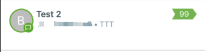

# ImageBadge

Badge component with custom image background for React Native


As `Badge` in `react-native-material-ui` doesn't support custom image as the badge icon (it does support material icons), this is a simple class to make this possible.


## Screenshots:

 


## Usage

Copy `ImageBadge.js` to your react native project, then:


```javascript
import ImageBadge from 'YOUR_PATH_TO_ImageBadge.js'
```

```javascript
              <ImageBadge
                imageSrc={require('YOUR_PATH_TO_IMAGE')} // like images/v_4.jpg
                styles={{
                badgeContainerStyle: { width: 50, height: 50 }, // size of badge
                badgeStyle: { color: 'blue', paddingBottom: 10 }, // position of badge text
            }}
                text="99" // badge text
              >
                <Text numberOfLines={1} style={style.list.title}>{title}</Text>
              </ImageBadge>
```


